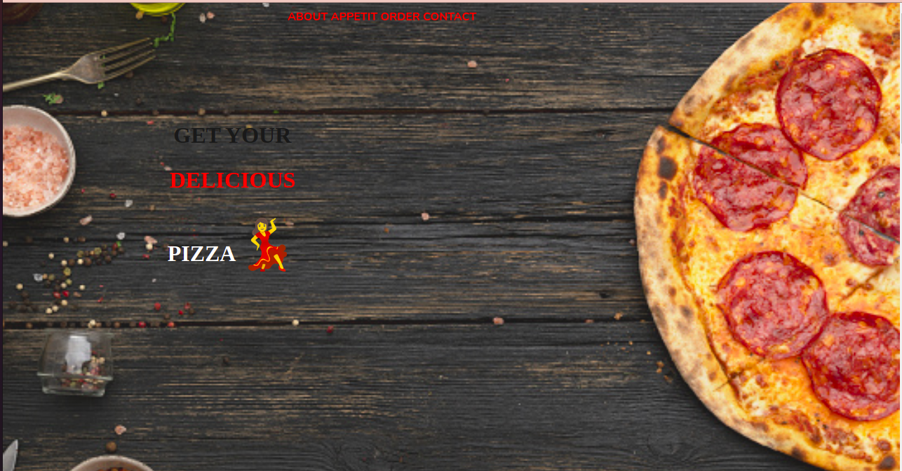
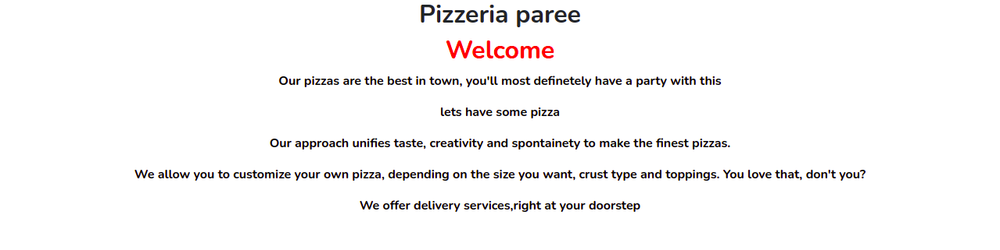
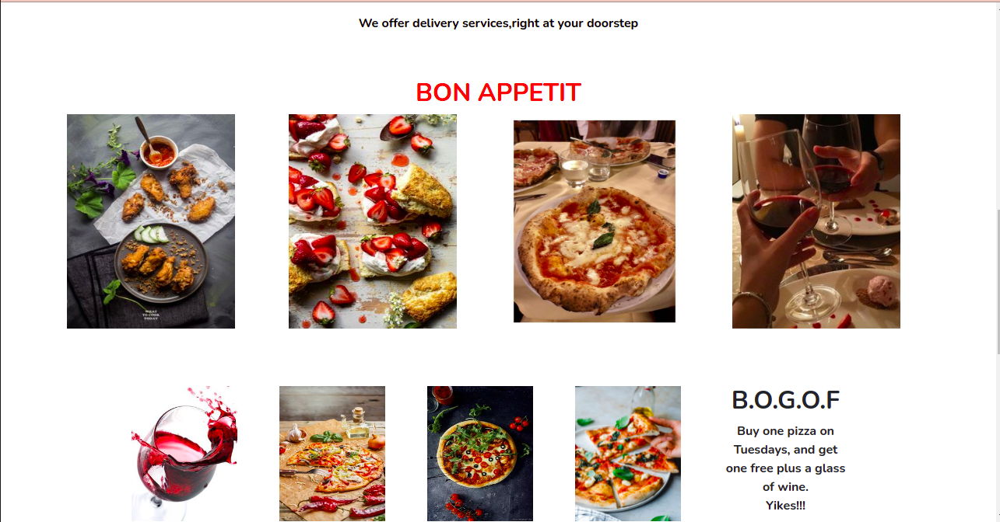
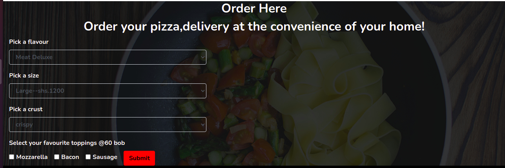
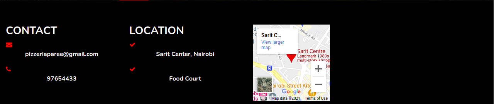

# PIZZERIA PAREE WEB
#### It's about a pizza shop, where user can order for pizza and it is delivered to them at their doorstep
#### By Laurette Mong'ina.
## Pizzeria Paree
This is a pizza shop where user can select the type of pizza they want, the size, type of crust they want and toppings price depends on size. Also, there is an option for delivery where user inputs their delivery details.

## Requirements
<ul>
<li>A code editor(vscode)</li>
<li>A github account</li>
<li>Internet.</li>
</ul>

## Setup/Installation
<ul>
<li>Clone this repository to your machine</li>
<li>Navigate to the top level of your directory.</li>
<li>Open the index.html in your browser</li>
</ul>

## Known Bugs
The web application runs well.
## Technologies Used
I used HTML,CSS and Java Script to create Pizzeria Paree. HTML for the structure and css for the styling. Javascript to validate the form and bootstrap for the grid system and button classes. I used vscode as my code editor and deployed on Github. I managed to add an emoji using html.
## Support and contact details
In case of any issues or you have question, concerns, ideas to implement and contributions, be sure to reach out to me via email (monginalaurette@gmail.com). Any contributions will be highly appreciated.Pull requests are highly welcome.
### License
[MIT].
Copyright (c) 2021 by Laurette Mong'ina.